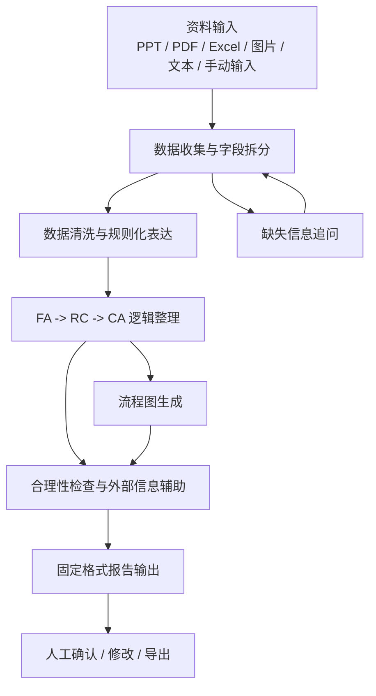
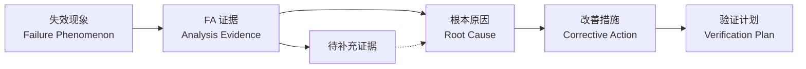

# FA Report Assistant Project Outline

## 1. 项目目标

本项目面向 FA（Failure Analysis）工程师，帮助他们将 PPT、PDF、Excel、图片、文本说明等零散资料，整理成逻辑清晰、格式固定、语言专业的 FA 报告。

核心目标不是简单翻译，而是完成以下工作：

- 收集并结构化 FA 报告所需信息。
- 按客户培训文件或内部规范清洗输入内容。
- 梳理 `FA -> RC -> CA` 的因果逻辑。
- 输出固定格式的正式报告。
- 在信息缺失、逻辑不完整或结论不充分时，主动提示工程师补充。

## 2. 总体流程



## 3. Step 1: 数据收集与报告拆分

### 3.1 输入来源

系统需要支持多种输入形式：

- PPT：现有 FA 报告、客户培训资料、内部 review 材料。
- PDF：客户文件、测试报告、规格书、供应商报告。
- Excel：测试数据、样品清单、失效统计、DOE 数据。
- 图片：显微镜照片、SEM/EDS 图片、X-Ray、外观照片、截图。
- 文本：工程师手动描述、邮件内容、客户反馈、会议纪要。
- 手动输入：用于补充固定字段或分支信息。

### 3.2 数据拆分方向

将输入资料拆分成固定信息块：

- 基本信息：客户、项目、产品、料号、批次、日期、负责人。
- 问题描述：客户反馈、失效现象、发生条件、失效率。
- 样品信息：样品数量、NG/OK 样品、生产批次、测试条件。
- FA 步骤：检查项目、分析方法、测试动作、观察结果。
- 关键发现：异常点、证据、图片说明、数据变化。
- Root Cause：直接原因、潜在原因、排除项。
- Corrective Action：改善措施、预防措施、验证计划。
- 结论：最终判断、责任归属、后续建议。

### 3.3 固定信息复用

如果系统中已经存在固定版本的信息，可以在输入阶段自动带出，并标记为可选或可编辑。

示例：

- 固定客户名称。
- 固定产品描述。
- 固定测试方法。
- 固定报告模板。
- 常用 FA 步骤。
- 常用术语中英文对照。

### 3.4 缺失信息追问

系统应识别必填字段是否缺失，并用中文追问工程师。

示例：

- “请补充失效样品数量和总样品数量。”
- “目前只有现象描述，缺少测试条件，请补充温度、电压、时间等信息。”
- “Root Cause 结论缺少证据支撑，请补充对应的测试结果或图片。”

## 4. Step 2: 数据清洗与规则化表达

### 4.1 清洗目标

将原始输入内容转化为符合客户培训文件和内部报告规范的表达。

清洗重点：

- 删除重复、口语化、不确定或无关内容。
- 将中文工程描述转成专业英文表达。
- 统一术语、单位、格式和时态。
- 将杂乱步骤整理成可读的 FA 过程。
- 将主观判断改写为证据驱动表达。

### 4.2 FA 步骤表达规则

FA 步骤建议强制采用：

`行动 + 结论`

示例：

- 原始表达：`看了一下外观，有点脏。`
- 规则化表达：`Performed visual inspection; contamination was observed on the connector surface.`

- 原始表达：`测了阻值，发现异常。`
- 规则化表达：`Measured resistance; abnormal resistance was detected on the failed sample.`

### 4.3 建议规则库

后续可根据客户培训 PPT 建立规则库：

- 标题命名规则。
- FA 步骤句式规则。
- 图片 caption 规则。
- 结论表达规则。
- 禁用词规则。
- 不确定性表达规则。
- 中英文术语规则。
- 数据单位和数值格式规则。

### 4.4 内容质量检查

清洗后需要检查：

- 是否每个 FA 步骤都有明确行动。
- 是否每个行动都有对应结论。
- 是否结论有数据、图片或测试结果支撑。
- 是否存在“可能、大概、应该”等弱判断但无证据。
- 是否存在前后矛盾。

## 5. Step 3: FA -> RC -> CA 逻辑整理

### 5.1 逻辑链定义

系统需要将分析过程整理为完整链路：

`Failure Phenomenon -> FA Evidence -> Root Cause -> Corrective Action -> Verification`

含义：

- Failure Phenomenon：客户或测试中观察到的失效现象。
- FA Evidence：通过测试、观察、数据分析得到的证据。
- Root Cause：由证据支持的根本原因。
- Corrective Action：针对 Root Cause 的纠正措施。
- Verification：验证 CA 是否有效的计划或结果。

### 5.2 AI 参与方式

AI 负责：

- 从输入资料中抽取逻辑链。
- 识别现象、证据、原因、措施之间的关系。
- 提出可能缺失的中间证据。
- 检查 Root Cause 是否跳跃。
- 检查 CA 是否真正对应 Root Cause。
- 将逻辑整理成工程师可确认的结构。

### 5.3 外部搜索参与方式

在允许联网或接入外部知识库时，系统可辅助：

- 查询相关失效模式。
- 查询材料、工艺、电子元件、连接器等领域知识。
- 查询标准、规格或行业通用定义。
- 对比类似 FA 案例的常见原因与改善措施。

注意：外部搜索结果只作为辅助参考，不能替代实际 FA 证据。

### 5.4 合理性检查

系统需要对逻辑链进行检查：

- FA 证据是否足够支持 Root Cause。
- Root Cause 是否只是现象复述。
- CA 是否针对 Root Cause，而不是只针对表面现象。
- 是否存在未排除的替代原因。
- 是否缺少验证计划。
- 是否存在过度承诺或责任判断风险。

### 5.5 流程图输出

系统应输出一张逻辑流程图，帮助工程师确认报告逻辑。

示例结构：



## 6. Step 4: 固定格式输出

### 6.1 输出格式

系统需要根据固定模板生成报告：

- Word 报告。
- PPT 报告。
- PDF 报告。
- Markdown 草稿。
- 中英双语版本。
- 英文客户正式版本。

### 6.2 建议报告结构

初版 FA 报告模板可包含：

1. Report Information
2. Background
3. Failure Description
4. Sample Information
5. Analysis Flow
6. FA Results
7. Root Cause
8. Corrective Action
9. Verification Plan
10. Conclusion
11. Appendix

### 6.3 输出前检查

报告生成前需要做最终检查：

- 必填字段是否完整。
- 图片和数据是否有说明。
- FA 步骤是否符合 `行动 + 结论`。
- RC 是否由 FA 证据支撑。
- CA 是否对应 RC。
- 英文表达是否专业、克制、可交付。
- 是否符合客户培训文件中的格式要求。

### 6.4 输出版本管理

建议支持不同版本：

- Draft：内部草稿，可包含待确认问题。
- Review：给主管或团队评审。
- Customer：客户正式版本，语言更谨慎。
- Bilingual：中英双语版本，方便工程师确认。

## 7. 系统模块建议

### 7.1 文件解析模块

负责解析 PPT、PDF、Excel、图片和文本内容。

输出结构化原始信息。

### 7.2 信息抽取模块

负责从原始内容中抽取报告字段。

输出字段化 JSON。

### 7.3 规则清洗模块

负责应用客户培训文件和内部规范。

输出规范化内容。

### 7.4 逻辑推理模块

负责整理 FA、RC、CA 关系。

输出逻辑链和风险提示。

### 7.5 报告生成模块

负责按模板输出 Word、PPT、PDF 或 Markdown。

### 7.6 人工确认模块

负责让工程师确认缺失信息、逻辑判断、最终结论和客户版本措辞。

## 8. 数据结构草案

后续可以将报告信息整理成类似结构：

```json
{
  "report_info": {
    "customer": "",
    "project": "",
    "product": "",
    "part_number": "",
    "date": "",
    "owner": ""
  },
  "failure_description": {
    "phenomenon": "",
    "failure_rate": "",
    "condition": "",
    "customer_statement": ""
  },
  "sample_info": {
    "failed_samples": "",
    "good_samples": "",
    "lot": "",
    "history": ""
  },
  "fa_steps": [
    {
      "action": "",
      "result": "",
      "evidence": "",
      "status": "confirmed"
    }
  ],
  "root_cause": {
    "statement": "",
    "supporting_evidence": [],
    "excluded_causes": []
  },
  "corrective_action": [
    {
      "action": "",
      "owner": "",
      "due_date": "",
      "verification": ""
    }
  ],
  "open_questions": []
}
```

## 9. 后续需要你提供的资料

为了把大纲变成可执行规则，需要逐步补充：

- 客户培训 PPT。
- 现有 FA 报告样例。
- 最终希望输出的报告模板。
- 常见产品类型和失效类型。
- 常用中英文术语。
- 哪些内容可以联网搜索，哪些内容必须只基于内部资料。
- 报告最终面向内部、客户，还是两者都需要。

## 10. MVP 建议

第一阶段可以先做最小可用版本：

1. 上传或粘贴一份 FA 原始资料。
2. 系统抽取报告字段。
3. 系统列出缺失信息。
4. 系统按 `行动 + 结论` 清洗 FA 步骤。
5. 系统生成 `FA -> RC -> CA` 逻辑链和流程图。
6. 系统输出 Markdown 或 Word 草稿。

第二阶段再增加：

- PPT/PDF/Excel 自动解析。
- 图片 caption 自动生成。
- 客户培训规则库。
- 外部搜索辅助。
- 多版本报告输出。
- 团队协作和历史案例复用。
