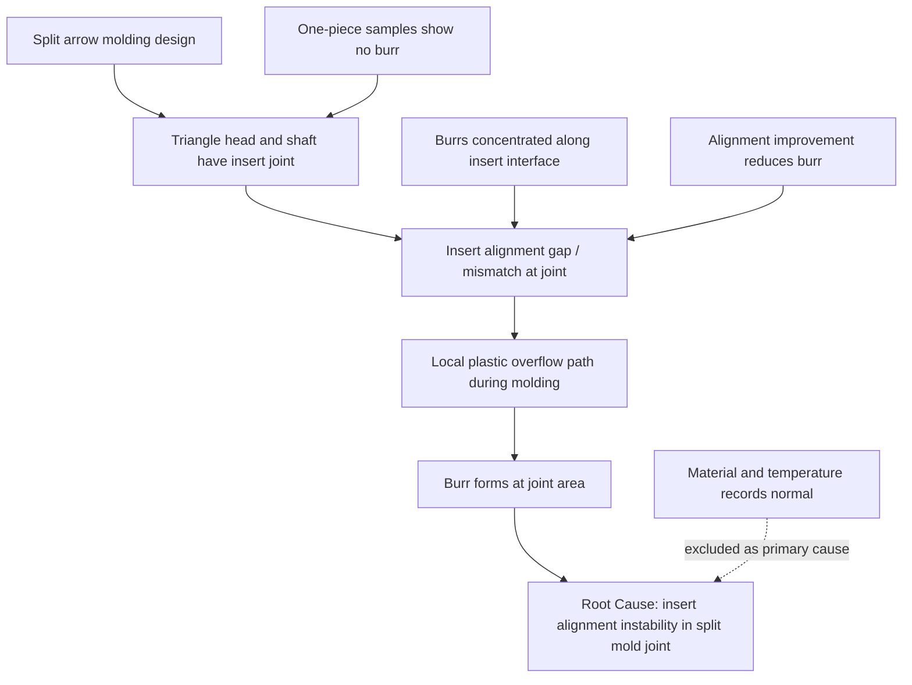

# FA Logic Demo: Split Arrow Burr at Joint Area

## Scenario

Issue: Burrs were observed at the joint area between the triangle head and arrow shaft in the split arrow molding design.

Goal: Demonstrate how to convert multiple FA observations into concise FA statements, a main logic line, and a report-ready conclusion.

## Raw FA Evidence

```text
- Visual inspection found burrs around the triangle-head and shaft interface.
- Good samples made by one-piece molding did not show burrs at the same location.
- Failed samples were made with a split design, where the triangle head and shaft were formed by separate mold features.
- Microscopy showed burrs concentrated along the insert joint line.
- Mold trial with improved alignment reduced burr occurrence.
- Material drying and injection temperature were checked, but no abnormal trend was found.
- Similar small plastic features with two-joint molding may have higher flash/burr risk if insert alignment is unstable.
```

## Concise FA Statements

```text
Performed visual inspection; burrs were observed at the triangle-head and shaft joint area.

Compared one-piece and split-molded arrows; burrs appeared only on split-molded samples.

Examined the joint area under microscope; burrs were concentrated along the insert interface.

Checked molding material and process temperature records; no abnormal trend was found.

Improved insert alignment during mold trial; burr occurrence was reduced.

Compared the burr location with mold structure; the defect matched the split insert joint line.
```

## Main Logic Line

```text
Split arrow design
-> insert joint exists between triangle head and shaft
-> insert alignment gap/mismatch creates local flash path
-> plastic overflow forms burr at joint area
-> root cause: two-piece mold insert alignment instability at the joint area
```

## Supporting Branches

```text
Branch 1:
One-piece molded samples showed no burr
-> supports that the burr is related to the split joint structure

Branch 2:
Material and temperature records showed no abnormal trend
-> excludes material drying and injection temperature as primary causes

Branch 3:
Alignment improvement reduced burr occurrence
-> supports insert alignment as the key driver
```

## Report-Ready Failure Analysis

```text
Performed visual inspection; burrs were observed at the triangle-head and shaft joint area.

Compared one-piece and split-molded arrows; burrs appeared only on split-molded samples.

Examined the joint area under microscope; burrs were concentrated along the insert interface.

Checked material and temperature records; no abnormal trend was found.

Improved insert alignment during mold trial; burr occurrence was reduced.
```

## Root Cause Draft

```text
The burr was caused by local flash at the split mold insert interface. Insert alignment instability at the triangle-head and shaft joint created a small overflow path during molding.
```

## Corrective Action Draft

```text
Replace the two-piece insert design with a one-piece mold structure for small arrow features, or tighten insert alignment control and add joint-area flash inspection before production release.
```

## Preventive Action Draft

```text
Avoid two-joint mold designs for small cosmetic features when a one-piece mold structure is feasible. Add split-joint flash risk review to future mold design checks.
```

## Logic Flowchart



## Customer Report Version

```text
Failure Analysis:
Performed visual inspection; burrs were observed at the triangle-head and shaft joint area. Compared one-piece and split-molded arrows; burrs appeared only on split-molded samples. Microscopy confirmed the burrs were concentrated along the insert interface. Material and temperature records showed no abnormal trend. Mold trial with improved insert alignment reduced burr occurrence.

Root Cause:
The burr was caused by local flash at the split mold insert interface. Insert alignment instability at the triangle-head and shaft joint created a small overflow path during molding.
```
