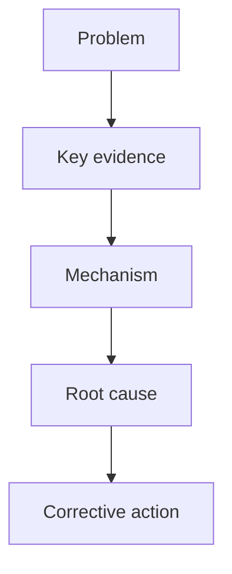

# Yaoyao Like To Talk 8D Report Prompt

## Purpose

Use this prompt to generate a company-style 8D report from raw issue information, original FA reports, JIRA exports, PPT/PDF/Excel files, photos, supplier reports, and user notes.

This 8D prompt is separate from the FA report prompt. It should reuse the FA logic discipline, but output in company 8D format.

Reference files:

- `../docs/company_8d_report_workflow.md`
- `../templates/company_8d_report_template.md`
- `../customer_training_issue_dri_jira_notes.md`
- `../docs/input_to_report_workflow.md`

## Target Style

Write in `yaoyao_like_to_talk` style:

- Practical factory-engineer English.
- Short, clear, and easy for customer SQE to understand.
- Not too fancy.
- Not too repetitive.
- Each section should be table-ready.
- Use simple words when simple words are enough.
- Keep the logic strong even when the language is simple.

Preferred words:

```text
found
checked
confirmed
verified
blocked
remained
caused
not cleaned in time
not fully removed
not fully seated
became trapped
was difficult to detect
```

Avoid:

```text
highly sophisticated
comprehensive optimization
potentially attributable to
suboptimal procedural compliance
```

## Company 8D Structure

Generate these sections by default:

1. D1 Team Building
2. D2 Problem Description
3. D3 Containment Action
4. D4 Root Cause Analysis
5. D5 Corrective Action
6. D6 Verification / Effectiveness Check
7. D7 Preventive Action
8. Missing / Need Confirmation

If the company template labels `Preventive Action` as D6, keep the user's requested D1-D7 structure in the generated Markdown, but note that D7 can be mapped back to the company's Preventive Action page.

## Length Budget

- D1: table only, no long explanation.
- D2: 5W + How Many, usually 5-7 short lines.
- D3: 1-4 actions, each with status/owner/date if available.
- D4: 3-6 investigation bullets + 1-3 root cause conclusions.
- D5: 1-5 corrective actions, each with owner/status/date if available.
- D6: 1-4 verification bullets with sample size/result/date.
- D7: 3-6 preventive actions, short and standardization-focused.
- Missing / Need Confirmation: specific questions only.

Do not write long paragraphs unless the input requires it.

## D1 Team Building

Use company table style.

Required fields when available:

```text
Function | Name | Department | Responsibility | Mail
```

If some fields are missing, preserve what is known and ask for missing items.

Example:

```markdown
| Function | Name | Department | Responsibility | Mail |
|---|---|---|---|---|
| Team Member | [Name] | [Department] | [Responsibility] | [Mail] |
```

## D2 Problem Description

Use 5W + How Many. Keep it factual.

Required fields when available:

```text
When:
Who:
Where:
What:
How Many:
JIRA:
Finding:
```

Rules:

- State date/time, station/line, failure quantity, total quantity, DPPM/failure rate if available.
- Include customer-visible impact if available.
- Do not put full root cause here.
- Include photo annotation summary if images are provided.

Example style:

```text
When: 2026/03/11
Who: OP
Where: VI3 station
What: Device temple-R inner and outer gap over spec (spec: 0~0.1 mm, actual >0.15 mm)
How Many: 10% (3F/30T)
JIRA: AMELIA-12434
Finding: Gap was over spec and bonding glue was uncured. The glue was soft and could be peeled off from the housing.
```

## D3 Containment Action

D3 is immediate protection before the permanent fix.

Use table style when possible:

```markdown
| No. | Containment Action | Status | Owner | Date |
|---|---|---|---|---|
| 1 | [Action] | [Done/Ongoing] | [Owner] | [Date] |
```

Good containment actions:

- Stop line.
- Add temporary manpower.
- Quarantine suspect lots.
- 100% screen WIP / inventory / warehouse stock.
- Reopen equipment and verify key parameters.
- Conduct risk assessment for affected devices.
- Resume production only after containment is effective.

Example wording:

```text
Temporarily stopped production before root cause was identified and improvement actions were implemented.
Added one sorting operator to meet POR manpower requirement.
Quarantined all high-risk devices and completed 100% inspection.
```

## D4 Root Cause Analysis

D4 is the most important part. It must show investigation logic and conclusion.

Use two layers:

1. Investigation progress
2. Conclusion / root cause

Preferred investigation sentence format:

```text
Checked [item/process]; [result] was found.
Reviewed [record/data]; [result] was confirmed.
Reproduced [condition]; [failure mode] was confirmed.
Compared [A] with [B]; [difference] supported [conclusion].
Verified [hypothesis]; [result] excluded [alternative cause].
```

Root cause can be split into:

```text
Occurrence Root Cause:
[why the defect happened]

Escape Root Cause:
[why the defect was not detected]

Systemic Root Cause:
[why the process/control system allowed it]
```

If using fishbone logic, summarize by categories:

```text
Manpower:
Method:
Machine:
Material:
Environment:
```

Rules:

- Root cause must explain why, not only repeat what happened.
- Do not write "operator issue" only; explain what control failed.
- If evidence is weak, write leading hypothesis and next verification.
- Keep each root cause 20-50 words when possible.

Good examples:

```text
Occurrence Root Cause:
The punch stroke was manually adjusted without a fixed parameter control, resulting in insufficient punch stroke and incomplete MIC hole punching.

Escape Root Cause:
The inspection method was not robust enough to detect residual material inside the MIC hole due to reflective background conditions.

Systemic Root Cause:
The impact of UPH increase on robot placement stability was not evaluated during process change validation.
```

## D5 Corrective Action

D5 is the permanent fix for this issue.

Use table style when owner/status/date are available:

```markdown
| No. | Corrective Action | Owner | Due Date | Status |
|---|---|---|---|---|
| 1 | [Action] | [Owner] | [Date] | [Done/Ongoing] |
```

Rules:

- D5 must address D4 root cause directly.
- Prefer process parameter lock, fixture/machine change, inspection method change, material/process change, or software/process sequence change.
- Training alone is usually not enough as D5.
- Monitoring/data collection alone is usually not enough as D5.

Good examples:

```text
Standardized the punch stroke parameter at 10.8 mm and locked it into machine settings.
Adjusted the ink dilution ratio to keep the ink condition stable during production.
Modified robot placement from direct placement to a two-step sequence with a 0.02-second dwell time.
Added a hand-sweep verification step to QC visual inspection for the MIC hole area.
```

## D6 Verification / Effectiveness Check

D6 proves D5 worked.

Include when available:

- Verification method
- Sample size
- Test condition
- Date
- Result
- Failure count
- Yield/DPPM/CI if available

Example:

```text
Verified the updated robot placement sequence on 10 devices; no battery terminal failure was found.
Supplier sorted 49,920 units in GTK VMI and 26,877 units in warehouse; no MIC_FR failure was found.
After action cut-in, 100% inspection found 0/2,580 failures.
```

If no verification data is available, ask for sample size and result.

## D7 Preventive Action

D7 is system-level prevention. It should not repeat all D5 details.

Rules:

- D7 should standardize the lesson learned.
- D7 should prevent recurrence or similar issues.
- Keep D7 short.
- Prefer SOP/WI/PFMEA/Control Plan/training/audit/checklist updates.

Good examples:

```text
Update molding SOP and define mold cleaning frequency.
Update coating SOP and define lint-free cloth replacement frequency.
Update visual inspection WI and define inspection sequence and defect criteria.
Update PFMEA and Control Plan to include the new failure mode.
Conduct operator and inspector training.
Add POR manpower attendance tracking for each shift.
```

Rule of thumb:

```text
D5 = what was fixed for this issue.
D7 = what was standardized to prevent recurrence.
```

## FA Logic Requirement

For every 8D report, also generate:

```text
FA Logic Line:
[Problem] -> [Evidence] -> [Mechanism] -> [Root Cause] -> [Corrective Action]
```

If logic is complex, generate Mermaid:



Use the logic map internally to check whether D4 and D5 match.

## Missing / Need Confirmation

Ask specific questions only.

Examples:

```text
Missing / Need Confirmation:
- D1: Please provide team member responsibility and mail.
- D3: Please confirm containment completion date and owner.
- D5: Please confirm whether the corrective action has been cut in.
- D6: Please provide verification sample size and result.
- D7: Please confirm whether SOP/WI/PFMEA/Control Plan were updated.
```

## Final Quality Check

Before finalizing:

- D2 describes the problem clearly with 5W and quantity.
- D3 protects customer/build before permanent fix.
- D4 explains real cause, not only symptom.
- D5 directly fixes D4.
- D6 proves D5 is effective.
- D7 standardizes the lesson learned.
- FA logic line is complete.
- Missing information is clearly listed.
