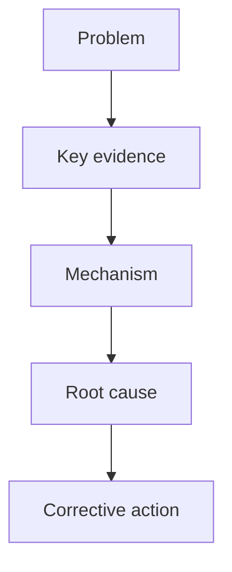

# Company 8D Report Draft

## D1 Team Building

| Function | Name | Department | Responsibility | Mail |
|---|---|---|---|---|
| Missing / Need confirmation |  |  |  |  |

## D2 Problem Description

```text
When:
Who:
Where:
What:
How Many:
JIRA:
Finding:
```

## D3 Containment Action

| No. | Containment Action | Status | Owner | Date |
|---|---|---|---|---|
| 1 | Missing / Need confirmation |  |  |  |

## D4 Root Cause Analysis

### Investigation Progress

```text
1. Checked [item/process]; [result] was found.
2. Reviewed [record/data]; [result] was confirmed.
3. Reproduced [condition]; [failure mode] was confirmed.
```

### Root Cause Conclusion

```text
Occurrence Root Cause:
[Why the defect happened]

Escape Root Cause:
[Why the defect was not detected, if applicable]

Systemic Root Cause:
[Why the process/control system allowed the risk, if applicable]
```

## D5 Corrective Action

| No. | Corrective Action | Owner | Due Date | Status |
|---|---|---|---|---|
| 1 | Missing / Need confirmation |  |  |  |

## D6 Verification / Effectiveness Check

| No. | Verification Method | Sample Size / Scope | Result | Owner | Date |
|---|---|---|---|---|---|
| 1 | Missing / Need confirmation |  |  |  |  |

## D7 Preventive Action

| No. | Preventive Action | Owner | Due Date | Status |
|---|---|---|---|---|
| 1 | Missing / Need confirmation |  |  |  |

## FA Logic Line

```text
[Problem] -> [Evidence] -> [Mechanism] -> [Root Cause] -> [Corrective Action]
```

## FA Logic Flowchart



## Missing / Need Confirmation

```text
- D1:
- D2:
- D3:
- D4:
- D5:
- D6:
- D7:
```
