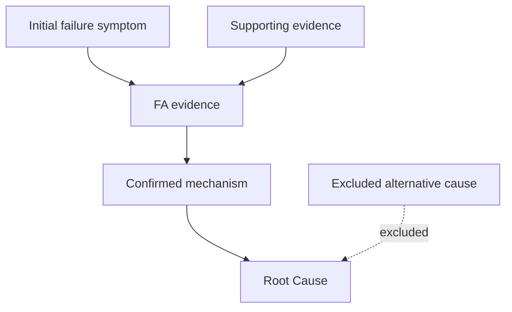

# FA Report Draft

## Issue

Missing / Need confirmation:
- Provide original test failure, customer complaint, or JIRA title.

## DRI(s)

Missing / Need confirmation:
- Provide reporter, issue owner, functional team, and full names.

## JIRA Ticket(s)

Missing / Need confirmation:
- Provide labcollab JIRA ID/link and master JIRA if multiple tickets exist.

## Risk

Missing / Need confirmation:
- Provide risk color, validation status, root cause status, solution status, and remaining exposure data.

## Description

Missing / Need confirmation:
- Provide discovery date, shift, station, production line, failure rate, repeatability, affected SKU/material, containment status, and current disposition.

## Customer Failure Mode

Missing / Need confirmation:
- Describe what the end user would experience, not only the factory test failure.

## Failure Analysis

Use concise fixed-format evidence sentences:

```text
Performed [test/action]; [result] was observed.
Compared [A] with [B]; [difference] confirmed [conclusion].
Measured [parameter]; [value/trend] indicated [finding].
Verified [hypothesis/condition]; [result] supported or excluded [cause].
```

Draft:

```text
Missing / Need confirmation:
- Provide FA evidence, measurements, comparison data, images, and excluded causes.
```

## FA Logic Line

```text
A -> B -> C -> Root Cause
```

Missing / Need confirmation:
- Provide enough evidence to connect the main logic chain.

## Supporting Branches

```text
Branch 1:
[Evidence] -> supports [logic link]

Branch 2:
[Evidence] -> excludes [alternative cause]
```

## FA Logic Flowchart



## Root Cause(s) / Leading Hypothesis

Missing / Need confirmation:
- Provide confirmed root cause or leading hypothesis with next verification actions.

## Containment Action(s)

Missing / Need confirmation:
- Provide temporary actions, affected scope, duration/end condition, and deviation ID if applicable.

## Corrective Action(s)

Missing / Need confirmation:
- Provide long-term design/process/material/specification/software changes and verification results.

## Preventive Action(s)

Missing / Need confirmation:
- Provide system-level prevention actions for similar products, projects, or processes.

## Next Steps & Dates

Missing / Need confirmation:
- Provide next checkpoint, due date, and DRI(s) for each open action.

## Factory Risk Assessment

Missing / Need confirmation:
- Provide yield impact, CTB impact, production efficiency, cost impact, affected scope, and recovery timeline.

## Field Exposure Risk Assessment

Missing / Need confirmation:
- Provide field DPPM, 95% CI upper limit, customer impact rationale, and supporting data.
